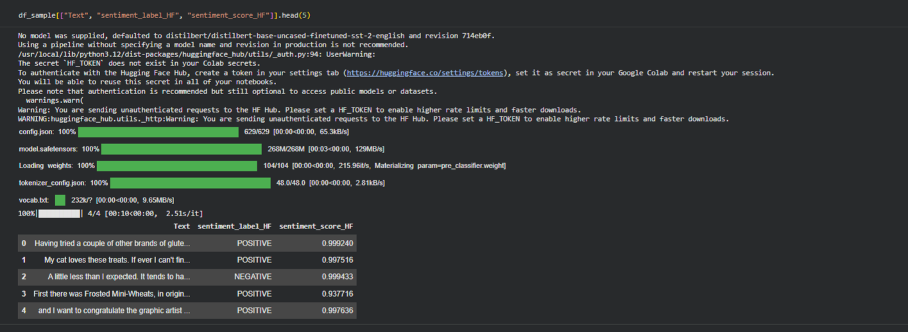
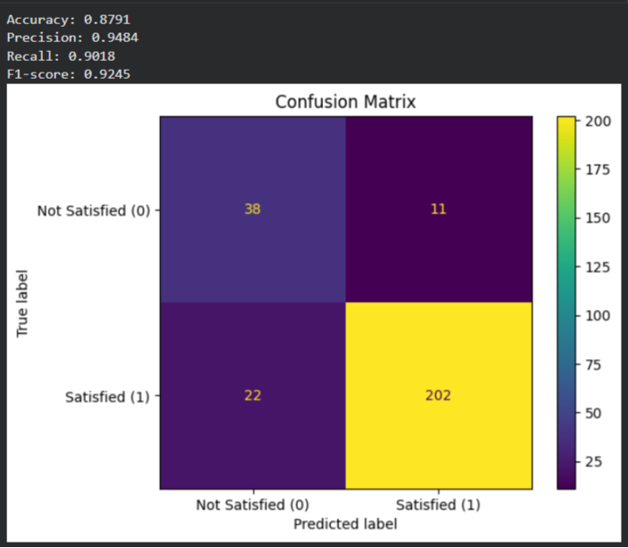
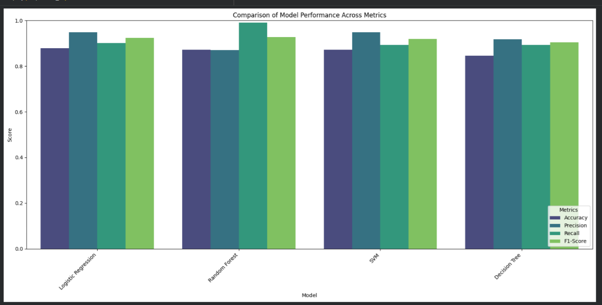

# Customer-Satisfaction-NLP
Predict Customer Satisfaction using AI and NLP

## Dataset
Amazon Fine Food Reviews (Kaggle sample)

## Overview
This project aims to analyze product reviews to predict customer satisfaction and extract actionable insights using Natural Language Processing (NLP) and machine learning.
The model does not rely solely on rating scores; it also focuses on analyzing customer sentiment within review text to capture the true customer opinion and context of the experience.  
This enables deeper insights into customer satisfaction even when ratings alone do not fully reflect the overall experience.

## Problem Statement
E-commerce platforms generate massive volumes of reviews that are difficult to analyze. Ratings alone do not capture the full customer experience, leading to missed insights.

## Research Question
Is there a statistically meaningful relationship between product ratings and review characteristics such as text length and helpful votes, and can these features be used to predict customer satisfaction?

## Objectives
- Identify the most influential review features
- Understand customer behavior patterns
- Build a predictive model for satisfaction
- Convert unstructured text into measurable business indicators
- 
## Target
Customer Satisfaction (CR) — Binary classification  
1 → Satisfied  
0 → Not satisfied

## Methodology
## Open Notebook in Colab

### Data Cleaning & Feature Selection
- Removed non-predictive identifiers
- Reduced noise and high-cardinality features
- Prepared structured dataset

### Feature Engineering
Behavioral indicators were created, including:
- Helpful Ratio
- Text Length
- Binary Customer Satisfaction (CR)

### Hybrid Sentiment Analysis
To improve robustness, we implemented a hybrid sentiment pipeline:
- Transformer-based sentiment analysis using Hugging Face
- Rule-based sentiment scoring using custom positive and negative word lists
- Extraction of frequent sentiment keywords
All sentiment signals were converted into structured binary features.

### Text Representation
TF-IDF vectorization was applied to:
- Extract informative terms
- Remove stopwords
- Convert reviews into numerical feature vectors

### Data Preparation
- Train/Test split (80/20)
- RobustScaler for feature normalization
- Class weight adjustment to handle imbalance

 ### Model Training & Evaluation
Multiple classification models were trained and compared.
Logistic Regression was selected as the best-performing model due to:
- Strong predictive performance
- Interpretability
- Suitability for business indicators

## System Impact
- Automatically analyzes user reviews at scale to extract sentiment, behavioral, and satisfaction signals  
- Transforms unstructured feedback into clear, quantifiable indicators  
- Enables deeper understanding of customer experience beyond rating scores  
- Supports product improvement and prioritization of issues  
- Helps teams make more informed, data-driven marketing decisions  
- Enhances overall platform efficiency by reducing manual review analysis

## Team

### Mohammed Alzanbahi — Data Cleaning & Exploratory Data Analysis (EDA)
- Cleaned raw dataset and handled missing values  
- Converted timestamps and prepared structured columns  
- Explored rating distribution and review patterns  
- Identified key variables influencing customer satisfaction  

### Rawabi Alharthi — NLP & Sentiment Analysis
- Implemented Transformer-based sentiment analysis using Hugging Face  
- Built rule-based sentiment scoring with positive and negative word lists  
- Extracted frequent sentiment keywords  
- Converted sentiment signals into structured binary features  

### Hala Alqurashi — Feature Engineering
- Created behavioral indicators such as Helpful Ratio and Text Length  
- Built Binary Customer Review (CR) target variable  
- Prepared TF-IDF text representation  
- Normalized features and handled class imbalance  

### Nasser Alsharif — Modeling & Evaluation
- Trained multiple classification models  
- Applied class weight tuning for imbalance  
- Compared model performance metrics  
- Selected Logistic Regression as the best-performing model and interpreted results  

## Results

### Sentiment Analysis Results

### Logistic Regression Results

### Model Comparison Results

